Factors Determining Quality of Red Wine
=======================================

    # load data
    rw <- read.csv('wineQualityReds.csv')

We will be examining a dataset (provided by Cortez et al) consisting of
1599 observations of Portugese red wine. Each observation contains
information about its physicochemical properties and a quality rating (0
to 10) calculated from the median of at least three expert evaluations.

Univariate Exploration
----------------------

Let's examine the columns, their data types, and values.

    str(rw)

    ## 'data.frame':    1599 obs. of  13 variables:
    ##  $ X                   : int  1 2 3 4 5 6 7 8 9 10 ...
    ##  $ fixed.acidity       : num  7.4 7.8 7.8 11.2 7.4 7.4 7.9 7.3 7.8 7.5 ...
    ##  $ volatile.acidity    : num  0.7 0.88 0.76 0.28 0.7 0.66 0.6 0.65 0.58 0.5 ...
    ##  $ citric.acid         : num  0 0 0.04 0.56 0 0 0.06 0 0.02 0.36 ...
    ##  $ residual.sugar      : num  1.9 2.6 2.3 1.9 1.9 1.8 1.6 1.2 2 6.1 ...
    ##  $ chlorides           : num  0.076 0.098 0.092 0.075 0.076 0.075 0.069 0.065 0.073 0.071 ...
    ##  $ free.sulfur.dioxide : num  11 25 15 17 11 13 15 15 9 17 ...
    ##  $ total.sulfur.dioxide: num  34 67 54 60 34 40 59 21 18 102 ...
    ##  $ density             : num  0.998 0.997 0.997 0.998 0.998 ...
    ##  $ pH                  : num  3.51 3.2 3.26 3.16 3.51 3.51 3.3 3.39 3.36 3.35 ...
    ##  $ sulphates           : num  0.56 0.68 0.65 0.58 0.56 0.56 0.46 0.47 0.57 0.8 ...
    ##  $ alcohol             : num  9.4 9.8 9.8 9.8 9.4 9.4 9.4 10 9.5 10.5 ...
    ##  $ quality             : int  5 5 5 6 5 5 5 7 7 5 ...

We see 11 continuous variables pertaining to physicochemical properties
and it would be excessive to create histograms and calculate descriptive
statistics for all of them. Fortunately the dataset builders have
identified specific variables that are expected to affect the perceived
quality of wine. We will also examine secondary properties to see if
they too bear a relationship to perceived quality.

Begin with **volatile acidity** measured in grams per cubed decimetre,
Cortez et al claim that too high levels 'can lead to an unpleasant
vinegar taste'.

    qplot(x = volatile.acidity, data = rw, binwidth = 0.1) +
      scale_x_continuous(breaks = seq(0, 1.5, 0.2))

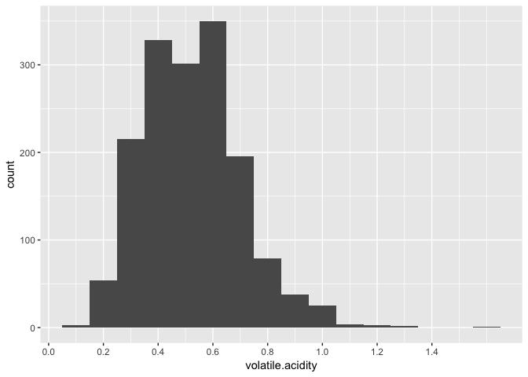

    summary(rw$volatile.acidity)

    ##    Min. 1st Qu.  Median    Mean 3rd Qu.    Max. 
    ##  0.1200  0.3900  0.5200  0.5278  0.6400  1.5800

So the distribution clusters around the mean, with the graph skewing
slightly right. Let's examine **citric acid**, which Cortez et al claim
adds freshness and flavour to wines when in small quantities.

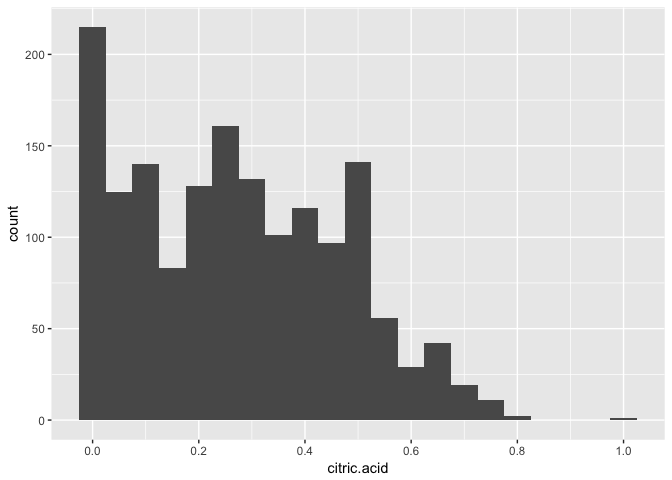

    ##    Min. 1st Qu.  Median    Mean 3rd Qu.    Max. 
    ##   0.000   0.090   0.260   0.271   0.420   1.000

This distribution does not have a strong central tendency and skews to
the right. Let's look at **residual sugar**, also measured in grams per
cubic decimetre: Cortez et al claim wines rarely have less than 1g/litre
or more than 45g/litre which is considered too sweet

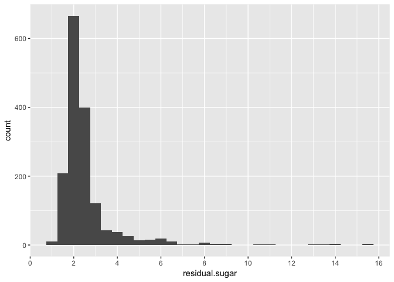

    ##    Min. 1st Qu.  Median    Mean 3rd Qu.    Max. 
    ##   0.900   1.900   2.200   2.539   2.600  15.500

This is indeed the case as the authors claim, our lowest observation
value is only 0.9 grams and the highest is 15.5 grams. Now, let's
examine **chlorides**, which is the amount of salt in the wine.
Obviously wine wouldn't taste too good if it was salty.

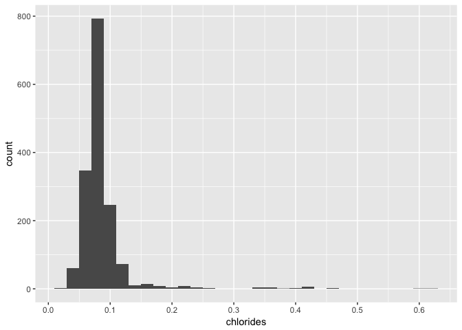

    ##    Min. 1st Qu.  Median    Mean 3rd Qu.    Max. 
    ## 0.01200 0.07000 0.07900 0.08747 0.09000 0.61100

Again, the distribution is similar to residual sugars. Let's consider
**free sulfur dioxide**, which Cortez et al claim prevents microbial
growth and oxidation of wine and is measured in parts per million (ppm).
Once it crosses 50 ppm, the taste and smell of wine changes.

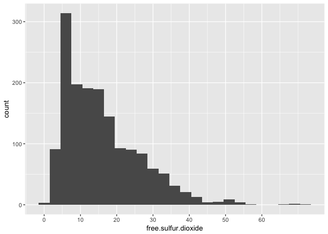

    ##    Min. 1st Qu.  Median    Mean 3rd Qu.    Max. 
    ##    1.00    7.00   14.00   15.87   21.00   72.00

There are very few observations crossing 50 ppm. Now let's examine the
**pH** or how acidic or basic the wine is: a pH of 0 is highly acidic
whilst that of 14 is very basic.

    ##    Min. 1st Qu.  Median    Mean 3rd Qu.    Max. 
    ##   2.740   3.210   3.310   3.311   3.400   4.010

Our wines are quite acidic, most of them cluster around a pH of 3 to 4,
without any exceeding that range. Finally, we consider the **alcohol**
content of our wines, with values represented as percentages.

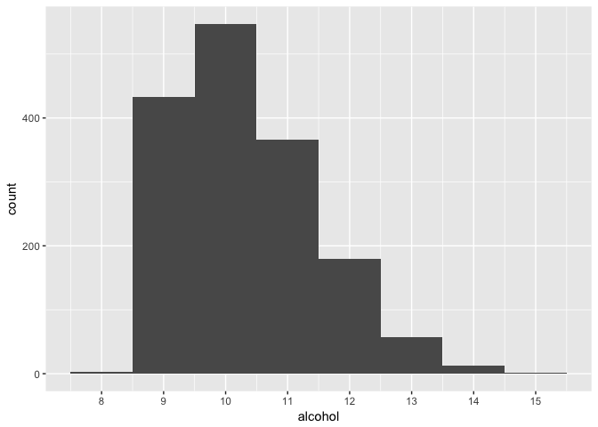

    ##    Min. 1st Qu.  Median    Mean 3rd Qu.    Max. 
    ##    8.40    9.50   10.20   10.42   11.10   14.90

So our wines have higher alcohol content than most beers, with a mean of
10.42% and the minimum being 8.4%, there is even a wine with an alcohol
content of 14.9%! I would certainly like to taste it, later we shall see
if higher alcohol content increases quality ratings.

Finally, lets look at the distribution of **quality** ratings for our
Portugese wines. Note this is a modified quality rating which is
calculated from taking the median of at least three reviews given by
wine experts.

    ggplot(rw, aes(x=factor(quality))) + geom_bar()

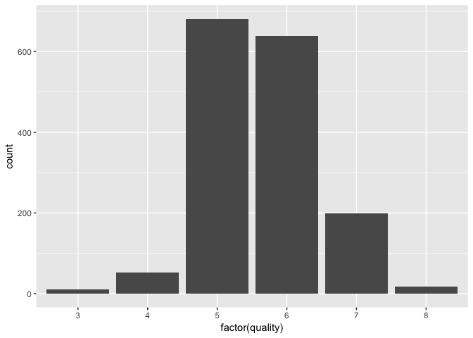

    ##    Min. 1st Qu.  Median    Mean 3rd Qu.    Max. 
    ##   3.000   5.000   6.000   5.636   6.000   8.000

So the vast majority of our wines are rated between 5 or 6, which is
fair. The lowest rating is a 3, but there are no perfect ratings either,
with the highest being an 8. This could be due to the prudent judgements
given by experts, and also because the final rating is calculated from
the median.

Let's create a categorical variable called 'class' based on ratings
given by experts. Our univariate plot shows ratings for all wines
falling between 3 - 8, so a class of 'poor' can be assigned for ratings
from 3 - 4, 'fair' for 5 - 6, and 'good' for 7 - 8. We can then use this
to see if the strength of the relationship between physicochemical
properties differs according to wine class.

    rw$class <- 
      ifelse(rw$quality > 6, 'Good', ifelse(rw$quality > 4, 'Fair', 'Poor'))

Now that we have created this new categorical variable, let's plot out
the distribution

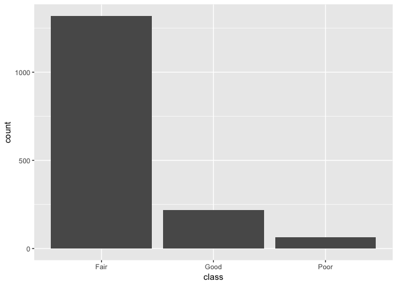

Univariate Analysis
-------------------

### Dataset Structure

Our dataset consists of 1599 observations with 11 variables, all
represented by values that are continuous and numerical. There are no
categorical variables, and all are in consistent units without any
missing values. All variables relate to either the physicochemical
properties of the wine, or the quality rating.

### Features of Interest

Most wines are acidic (low pH), have low residual sugar (below the 45g
threshold that would be considered too sweet), and low free sulfur
dioxide (less than the 50ppm that would be noticeable in taste and
smell). On average the alcohol content is around 10%. Most wines have a
quality rating of 5 - 6, which we define as 'fair'. A natural avenue for
exploration in this data set is how these physicochemical properties
affect the quality rating. But we could also consider how such
properties are related to each other, and whether such relationships are
affected by wine quality.

### Variables

A new categorical variable was created based on the quality rating the
wine received, this will allow us to see if the strength of
relationships between physicochemical properties varies by wine quality.
No data wrangling was necessary because the variables are already in
consistent units without missing values. Although some variable
distributions like residual sugars and chlorides had outliers or a long
tail, this didn't prevent us from clearly observing the values
distribution thus no transformations were necessary.

Bivariate Exploration
---------------------

Cortez et al have already described the physicochemical properties they
expect to influence quality ratings, and we have examined their
distributions using univariate plots. Here we will use a scatter plot
matrix to gain a high level overview of the relationship between these
primary physicochemical properties and quality ratings, in addition to
how they relate to each other.

    primary = c("free.sulfur.dioxide", "volatile.acidity", "citric.acid", 
                "residual.sugar", "alcohol", "quality")
    ggpairs(rw[primary])

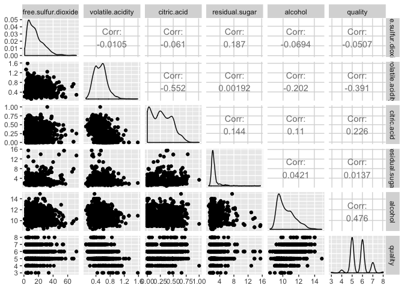

Let us get to the key question of how primary physicochemcial properties
affect quality ratings. It can be seen that **alcohol** percentage is
strongly correlated with quality (0.476).

    ggplot(aes(alcohol, quality), data = rw) + 
      geom_jitter(alpha = 0.3) 

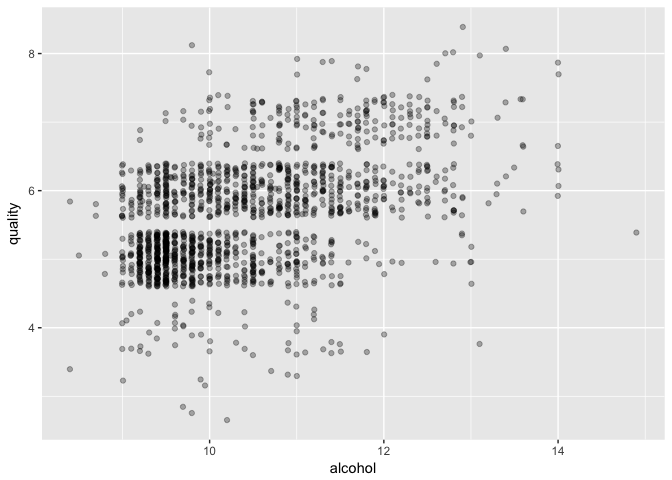

Here is visual evidence that wines with higher alcohol percentages
attract higher quality ratings. This is one aspect that Cortez et al
have not remarked upon. **Residual Sugar** on the other hand is shown to
be very weakly correlated with quality ratings, at only 0.0137- this is
likely because there is very little variation in residual sugar values
and they never exceed the threshold (45g) at which the authors state
would degrade the wine tasting experience.

**Citric acid** is also found to be positively correlated with quality
ratings, at 0.226.

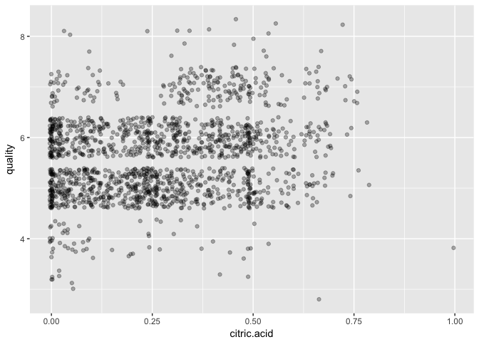

Higher level of citric acid are associated with higher quality ratings
and this is consistent with the Cortez et al's comment that the presence
of citric acid adds freshness to the wine.

On the other hand, **volatile acidity** is negatively correlated with
quality ratings, at -0.391.

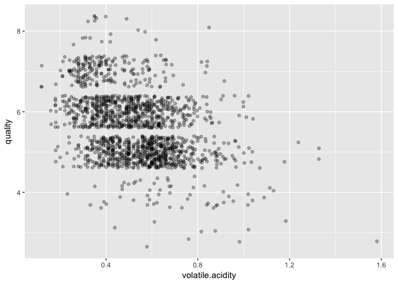

This is consistent with Cortez et al's observation that higher levels of
such acetic acid can lead to an unpleasant and sour taste. Our matrix
also presents a strong negative correlation between citric acid and
volatile acidity at -0.552

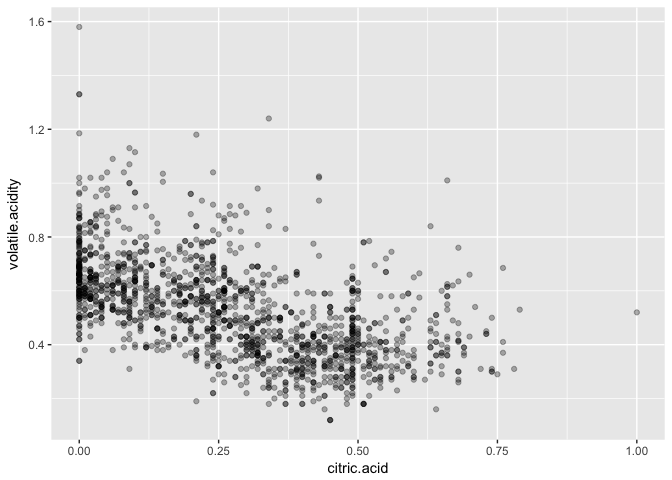

The more citric acid, the less volatile acidity. Further on we will
attempt to see if this relationship is particularly strong for higher
rated wines, is there some kind of special production process that gives
certain wines an advantage?

Now that we have examined the primary physicochemical properties, we
must consider secondary physicochemical properties that Cortez et al
were less attentive towards. Do they have any relationship with quality
ratings? Do they have any relationship with each other?

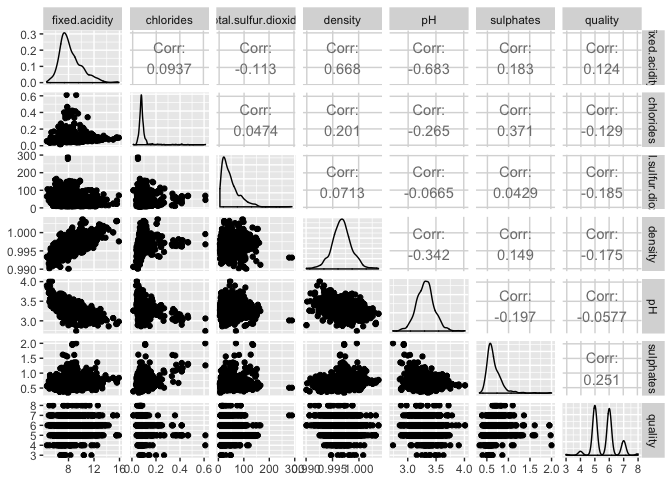

The matrix show a positive relationship between **sulphates** and
quality ratings, with a correlation of 0.251.

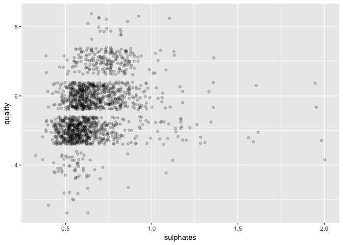

It is not clear why adding sulphates improves quality ratings, Cortez et
al mention that doing so leads to an increase in free sulfur dioxide
which prevents microbial growth and oxidation of wine, but previous
calculations show that the relationship between free sulfur dioxide and
rated quality is weakly negative.

The matrix also shows a strong correlation between **density** and
**fixed.acidity** at 0.668.

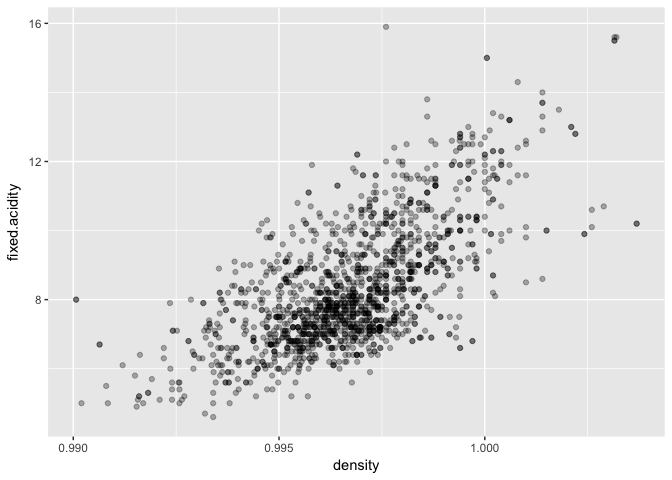

This show wine density increasing with higher levels of non-evaporative
acidity. We will see if the strength of this relationship changes with
the quality rating of the wine.

Note that a highly negative relationship exists between **pH** and
**fixed acidity** with a correlation of -0.683, but it is self
explanatory why this is so: a lower pH is by definition more acidic.

Bivariate Analysis
------------------

The dataset authors already commented on the primary physicochemical
properties they believed influenced quality ratings. Our bivariate plots
and calculations largely confirmed their analysis: for example volatile
acidity (or acetic acid) has a -0.391 correlation with quality ratings,
citric acid is positively correlated with quality ratings at 0.226.
However one relationship Cortez et al didn't discuss was that between
alcohol and quality rating, where there was a strong positive
correlation of 0.476.

Citric acid has a strong negative correlation with volatile acidity:
-0.552. Any wine that can leverage this relationship can substantially
improve its ratings from experts. We will be doing further investigation
to see if higher quality wines embody this relationship. Density is
highly correlated with fixed acidity (0.668), further investigation will
be conducted to see if the strength of the relationship varies with wine
quality.

Multivariate Plots Section
--------------------------

Based on our bivariate plots, we know that there is a strong negative
correlation between citric acid and volatile acidity. Does the magnitude
of this negative relationship differ according to the quality rating of
the wine?

    ggplot(aes(x = citric.acid, y = volatile.acidity), data = rw) + 
      geom_point(aes(color = class), alpha = 0.5)

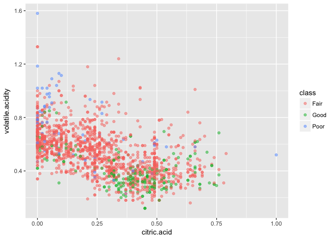

Our plot demonstrates that highly rated wines (represented in green)
tend to have high citric acid and low volatile acidity, whereas poorly
rated wines (represented in blue) tend to have low citric acid and high
acetic acid, whereas fairly rated wines are in between.

We also found a strong correlation between density and fixed acidity:
0.668. Does the strength of the relationship vary depending on the class
of wine?

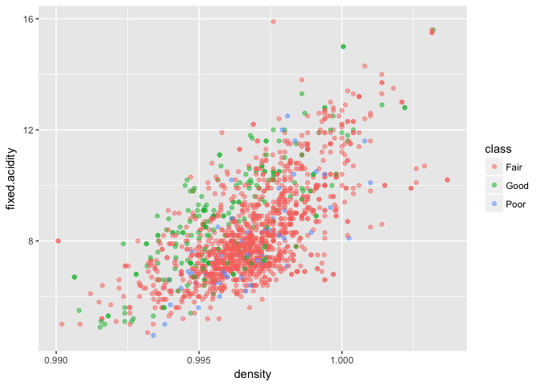

Our plot demonstrates that the strength of the relationship between
density and fixed acidity is not contingent upon the class of wine.

Multivariate Analysis
---------------------

Our previous bivariate plots showed that citric acid was positively
correlated with quality ratings, and volatile acidity was negatively
correlated with quality ratings. The plots also showed that volatile
acidity and citric acid have a strongly negative relationship with each
other. The multivariate plot shows that this negative correlation is
particularly pronounced with higher quality wines.

The fact that 'good' class wines, or higher quality wines embody a
particularly strong negative relationship between citric acid and acetic
acid, seems to suggest that this is one of the key mechanisms by which
they attract high ratings: by lowering the amount of acetic acid (which
Cortez et al claim lead to a sour taste) and raising the amount of
citric acid (which is claimed to lead to fresh taste). There may, in
fact, be some kind of special production technique at play.

------------------------------------------------------------------------

Final Plots and Summary
-----------------------

### Plot One

    qplot(x = factor(quality), data = rw, main="Distribution of Quality Ratings for Wine", 
          ylab="Count", xlab="Quality Rating (0 to 10)")

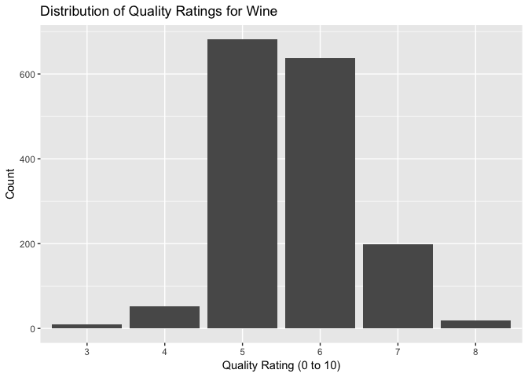

The plot illustrates that ratings for our 1599 wine observations are
surprisingly stable, the vast majority given are 5 or 6. The lowest
rating is a 3 and the highest is an 8. This may be due to calculation of
ratings based on the median of three, rather than as a mean. It may also
say something about the nature of reviewers or the nature of the wine.
We need more information about how the data was collected to make
further inferences.

### Plot Two

    ggplot(aes(factor(quality), alcohol), data =  rw) + geom_jitter(alpha = 0.4) + 
      geom_boxplot(aes(group = quality), alpha = 0.5, color = 'blue') +
      ggtitle("Alcohol Content per Wine Quality") +
      ylab("Alcohol (%)") +
      xlab("Quality Rating (0 to 10)")

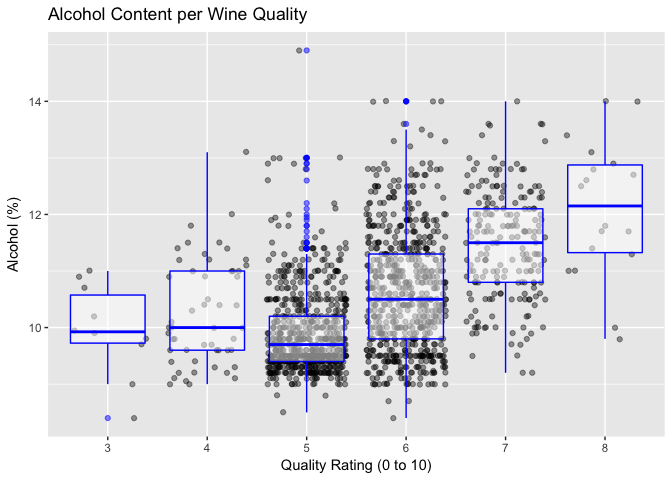

A key finding from our study, and one not mentioned by the authors, is
the positive relationship between alcohol and quality ratings (0.476).
The higher the quality rating, the higher the alcohol content tends to
be.

### Plot Three

    ggplot(aes(x = citric.acid, y = volatile.acidity), data = rw) + 
      geom_point(aes(color = class), alpha = 0.6) + xlab("Citric Acid (g/cubic decimetre)") +
      ylab("Volatile Acidity (g/cubic decimetre)") + 
      ggtitle("Relationship between Citric Acid and Volatile Acidity")

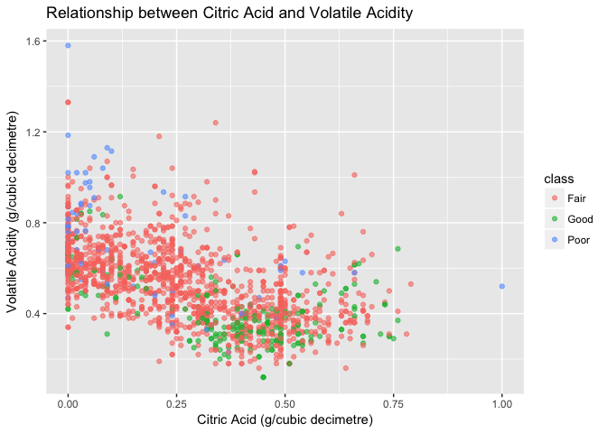

In general citric acid is negatively correlated with volatile acidity
(or acetic acid): -0.552. Higher levels of citric acid are positively
associated with quality ratings, the opposite is true for volatile
acidity. The nature of the relationship is particularly strong for high
quality wines, which tend to have the highest amounts of citric acid,
and the lowest amount of acetic acid. Have those producers found some
special process for making wines that win the praise of critics?

------------------------------------------------------------------------

Reflection
----------

Exploration of the dataset has had benefits and challenges. The easy
part has been the lack of missing values and cleanliness and consistency
in the format of the data. The challenge has been lack of categorical
variables that could provide further insight. For example, knowing the
region or the type of soil in which the wines were grown could have
yielded additional insights in terms of understanding relationships
involving quality ratings or physicochemical properties. Nevertheless we
have been able to gain some insights about what drives wines to gain
higher quality ratings: namely alcohol content, and the inverse
relationship between citric and acetic acid. In the future, taking the
mean rather than the median of expert ratings may provide a more
accurate picture of how the wines were received. Adding additional
categorical information such as fermentation method, soil type,
producer, would help us find additional insights into what makes great
wine, and what produces certain physicochemical properties.
